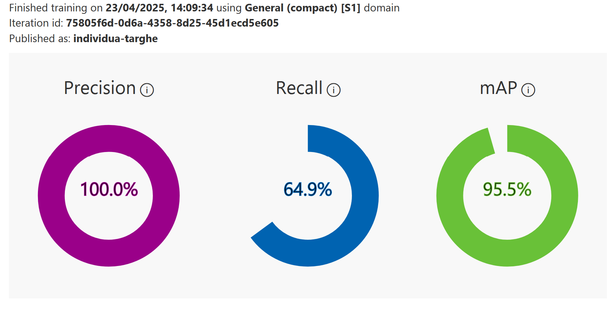

# Piccolo progetto POC per l'utilizzo dei servizi ML di Azure
Questo POC nasce come risposta alla domanda del momento nelle aziende italiane, e probabilmente non solo, fatta dal managment agli sviluppatori (o reparto/ufficio/team equivalente) e cioè: "Ma perché non usiamo anche noi l'AI nei nostri progetti?" Qualsiasi cosa significhi questa domanda.

## Scopo
Lo scopo di questo POC è quello di valutare la semplicità di utilizzo dei servizi ML di Azure ricreando un caso di business per dimostrare se è più conveniente l'utilizzo di servizi SAS o l'implementazione a codcie delle funzionalità richieste. La correttezza di questa valutazione vale UNICAMENTE nel caso in cui non si tratti di un progetto di ricerca volto a progettare da zero un modello di ML/DL. Chi fa "ricerca" e "prototipazione" potrebbe beneficiare di una scelta ibrida.

## Il caso di business considerato
La funzionalità che vogliamo realizzare dovrà:
- Prendere in input una immagine
- Identificare un particolare tipo di oggetto all'interno dell'immagine
- Estrarre l'immagine dell'oggetto in questione
- Utilizzarel 'immagine estratta per verificare se vi è del testo sull'oggetto in questione
- Decodificare il testo presente

L'oggetto in questione è una targa automobilistica.

## Obiettivi secondari del progetto
Gli obiettivi secondari sono i seguenti:
- Determinare il TCO del progetto suddividendo i costi "una tantum" dai costi "di avvio" e dai costi di "esecrizio".
- Determinare l'accuratezza delle funzionalità ML
- Esplorare le fasi di predisposizione delle attività in modo che includessero l'uso di un modello allenato su uno specifico dato

## Obiettivo bonus
Se possibile dovrà essere raggiunto un obiettivo ulteriore. La realizzazione di una delle funzionalità ML direttamente a codice senza l'ausilio di servizi SAS. Questo servirà per fornire un ulteriore elemento di valutazione. Per questa funzionalità dovrà essere usato lo stesso modello utilizzato in SAS.

## L'esecuzione delle attività di progetto
Nella realizzazione del progetto sono state effettuate le seguenti attività. La tabella sottostante le ricapitola indicando il tempo impiegato e il tipo di costo. L'attività può essere affidata unicamente a persone con una discreta competenza nella gestione della progettazione e dello sviluppo del codice.

| Tipo di attività | Tempo uomo impiegato | Tipo di costo |
|------------------|----------------------|---------------|
| Studio delle soluzioni e comprensione del problema | 32 ore | una tantum |
| Scelta dell'attività di base per l'allenamento del modello e il tipo di modello da allenare | 6 ore | di avvio |
| Implementazione e testing del codice | 13 ore | a progetto |
| Stesura documentazione | 1 ora | a progetto |
| Ulteriore codice non SAS | 16 ore | a progetto |
**Tempo totale**: **68** ore

Il progetto non può essere considerato "pronto per la produzione" in quanto la funzionalità è solo "tecnica" e non è contestualizzata all'interno di una funzionalità utente.

## Informazioni addizionali che hanno influito nelle scelte di progetto
Nella realizzazione del progetto ho effettuato alcune scelte che ovviamente hanno avuto impatto sulla realizzazione e sulla struttura dello stesso.

- Analizi delle funzionalità di Azure in via preferenziale (soluzione già usata in azienda e di cui avevo già una discreta conoscenza). La scelta, pur consapevole che prioritaria è la scelta più efficiente, è stata motivata dalla necessità di risparmiare più tempo possibile cercando di uniformarsi a quanto già usato in azienda in temrini di conoscenza e disponibilità immediata. Alternativamente avevo considerato di utilizzare AWS o Google Cloud ma il tempo di apprendimento e l'analisi di disponibilità delle soluzioni si sarebbe ovviamente allungato. La soluzione con Google cloud è stata volutamente citata per ultima in quanto, ad oggi, non sembra così ben posizionata, rispetto ai concorrenti, nel segmento AI.
- Scelta di Rust come linguaggio di progetto. Rust non è "ufficialmente" supportato dalla documentazione di Azure in termini di esempi di codice. Come evidente da [questa](https://learn.microsoft.com/it-it/azure/ai-services/Custom-Vision-Service/quickstarts/image-classification?tabs=windows%2Cvisual-studio&pivots=programming-language-rest-api) documentazione Microsoft alla data odierna solo C#, Go, Java, JavaScript, Python sono supportati, oppure si possono fare chiamate API con curl (Invoke-WebRequest). Questo aspetto era particolarmente importante in quanto volevo evitare l'effetto copia & incolla che da una parte fa risparmiare tempo ma non fa comprendere come realizzare il progetto (lo scopo è sviluppare una funzionalità comprendendo il meccanismo di funzionamento e non scaricando codice già scritto da altri e martellandolo per trasformarlo in quello che serve).
- Scelta di un modello che effettuasse, tramite allenamento, il riconoscimento specifico dell'elemento da identificare successivamente. Anche se sono due passaggi il  fatto di identificare un elemento e quindi poi andare a lavorare solo sull'elemento identificato per la fase successiva permette di avere più controllo sul processo e di poter allenare un solo modello elemento evitando di allenare anche il modello di riconoscimento testo (per evitare di riconoscere tutti gli elementi di testo presenti in una foto).

## Verifica del progetto
Il training del modello per il riconoscimento dell'oggetto è stato realizzato usando il tier F0 (gratuito) per due ore con il seguente risultato:

Il risultato è considerato soddisfacente.

Una esecuzione tipica del codice (non benchmark) porta a questi risultati:

Durata chiamata identificazione oggetto: 1.291580659s
Durata chiamata riconoscimento: 1.414668751s
Numero di targa: XX.725XX

## Caratteristiche addizionali
Dai workspace ML di azure è possibile scaricare il modello allenato per le seguenti piattaforme:
- ONNX (anche float16 per Windows ML e ML.NET)
- CoreML (iOS)
- TensorFlow (android)
- VAIDK (Vision AI Dev Kit)
- OpenVino
E' anche possibile esportare il modello da usare con un Dockerfile (Azure IoT Edge, Azure Functions, AzureML)

## Comparazione con esecuzione in locale
Per verificare ulteriormente la flessibilità della soluzione SaS è stato esportato il modello di individuazione oggetti e verificata la previsione con ONNX su WSL, con il supporto CUDA per l'utilizzo dell'accelerazione GPU.
Non sono considerabili esecuzioni senza GPU per le scarse prestazioni delle CPU generaliste.

E' stata misurata UNICAMENTE l'esecuzione dell'iterazione del modello e non tutto il codice di contorno per preparare i tensori e per preparare l'immagine su cui generare il tensore.

Il tempo di elaborazione risultante è indicato qui sotto:

Durata chiamata di identificazione dell'oggetto con ORT-ONNX (CUDA): 4.984902321s
